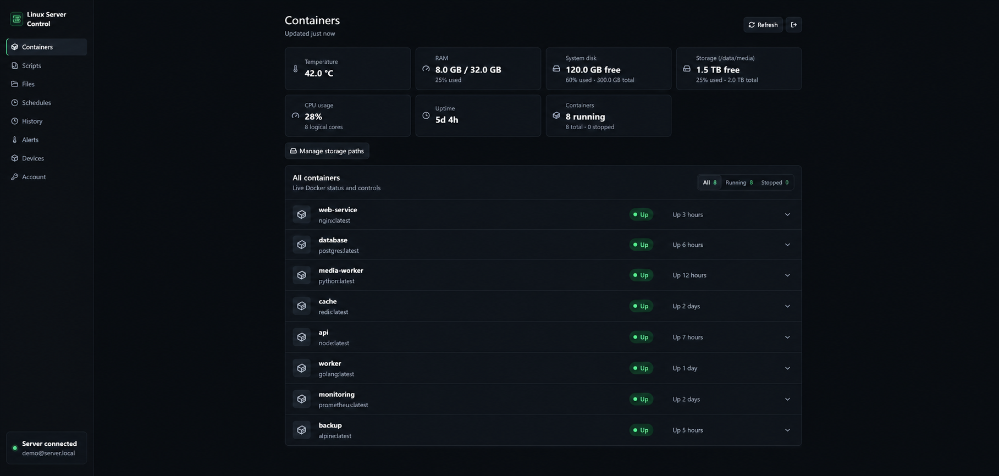
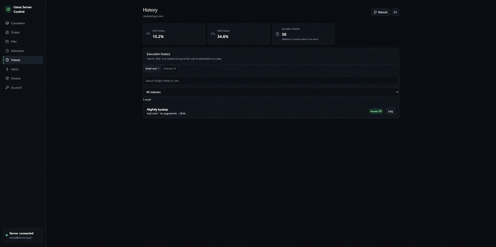

# Linux Server Control

Linux Server Control is a self-hosted dashboard for administering one Linux server from a browser. It is built with Next.js and TypeScript and runs as Docker containers.

## Features

- View running and stopped Docker containers
- Start, stop, restart, and inspect container logs
- Register shell scripts and organize them into folders
- Create executable custom shell scripts inside approved directories
- Choose whether each script runs as the SSH user or root
- Define safe dropdown arguments and file selections for scripts
- Run scripts and follow their logs live
- Keep script execution history with status, timing, arguments, and per-run logs
- Configure cooldown-based health alerts and retain compact system metric history
- Export and restore dashboard configuration without exporting credentials
- Create, edit, pause, and delete guided cron schedules or one-line custom commands (root schedules require approved scripts)
- Browse, edit, and delete files inside explicitly allowed directories
- Authorize and revoke individual browsers
- Restrict access to a LAN subnet, with optional Tailscale access

## Screenshots

All screenshots below use anonymized demonstration data only.

### Containers and storage monitoring



### Script and cron execution history



## Quick start

The default installation is LAN-only. It uses a dedicated SSH key so the dashboard container can execute approved operations on the host.

See **[INSTALL.md](INSTALL.md)** for the complete installation tutorial, optional root cron support, Tailscale HTTPS, upgrades, and troubleshooting.

```bash
git clone https://github.com/Florincamarut1/linux-server-control.git
cd linux-server-control
cp .env.example .env
```

Edit `.env`, then follow the key and certificate setup in the installation guide.

## Install without cloning Git

If Docker is already installed on the server, this is the shortest supported
deployment. Docker will fetch the application source from GitHub at build time;
the local directory contains only your configuration, SSH material, and
persistent dashboard data.

```bash
mkdir -p ~/linux-server-control && cd ~/linux-server-control
curl -fsSLo compose.yaml https://raw.githubusercontent.com/FlorinCamarut1/linux-server-control/main/compose.github.yaml
curl -fsSLo .env https://raw.githubusercontent.com/FlorinCamarut1/linux-server-control/main/.env.example
mkdir -p data ssh
chmod 700 data ssh
nano .env
```

Set `LAN_IP`, `LAN_CIDR`, `SSH_TARGET`, `SCRIPT_ROOT`, `ALLOWED_PATHS`, and
`REMOTE_LOGS` in `.env`. These values deliberately require an administrator's
choice: they define which host is controlled and which files the dashboard may
change.

Create the dedicated SSH key and verify the host fingerprint before trusting it:

```bash
ssh-keygen -t ed25519 -N '' -C linux-server-control -f ssh/id_ed25519
cat ssh/id_ed25519.pub >> ~/.ssh/authorized_keys
# Replace with the exact hostname or IP used in SSH_TARGET.
ssh-keyscan -H 192.168.1.100 > ssh/known_hosts
chmod 600 ssh/id_ed25519
```

Create the LAN certificate, replacing the IP with the value from `.env`:

```bash
openssl req -x509 -newkey rsa:3072 -nodes -keyout data/key.pem -out data/cert.pem -days 365 -subj '/CN=192.168.1.100' -addext 'subjectAltName=IP:192.168.1.100'
chmod 600 data/key.pem
sudo chown -R 1000:1000 data ssh
```

Finally, choose a password and start it. Future upgrades are one command.

```bash
DASHBOARD_PASSWORD='use-a-long-unique-password' docker compose run --rm dashboard node scripts/setup.mjs
docker compose up -d --build
# Upgrade later: docker compose build --pull dashboard && docker compose up -d
```

Open `https://LAN_IP:8443`. The first browser still needs an enrollment code;
generate it with `docker compose run --rm dashboard node scripts/enroll.mjs`.

## Security model

- The dashboard service is not published directly; Caddy is the only exposed container.
- Caddy accepts LAN traffic only from `LAN_CIDR`.
- Passwords are hashed with scrypt.
- New browsers require a short-lived enrollment code.
- Session and device cookies are HTTP-only, secure, and SameSite strict.
- Five failed passwords from one address trigger a 15-minute block.
- SSH host-key verification is mandatory.
- File and script access is limited to `ALLOWED_PATHS`.
- Containers run with a read-only filesystem, dropped Linux capabilities, and `no-new-privileges`.

An authorized dashboard user can control Docker and files inside the configured locations. Docker access commonly grants root-equivalent control over the host. Keep the dashboard on trusted private networks, use a long unique password, and never forward port `8443` from the internet.

## Development

```bash
npm ci
npm run dev
```

Production verification:

```bash
npm run build
```

## License

[MIT](LICENSE)
