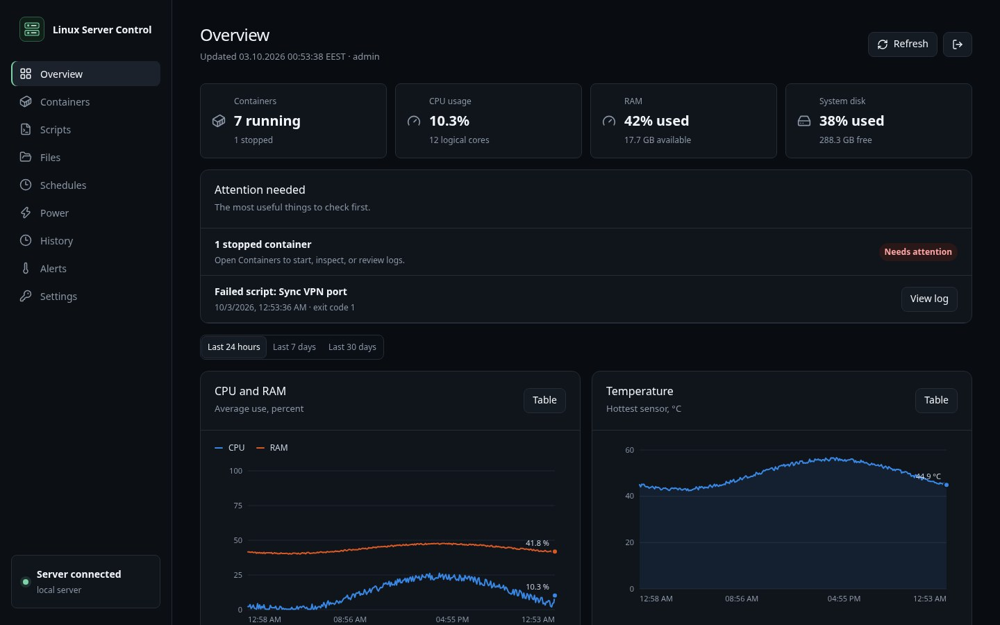

# Linux Server Control

A private dashboard for one Linux server: Docker containers, approved scripts, schedules, files, storage, and browser access—all from a browser.

It is intended for people comfortable administering their own server. It runs entirely in Docker and controls the host through a dedicated SSH key; it does not mount the Docker socket.

## What it does

- See, start, stop, restart, and inspect Docker containers, and open their web interfaces in one click.
- Run approved shell scripts and follow the exact run log live.
- Create and manage guided cron schedules.
- Browse and edit files only inside paths you explicitly allow.
- Chart CPU, RAM, temperature, and storage over the last day, week, or month.
- Record power use and cost from Tapo, Shelly, Tasmota, or Home Assistant smart plugs.
- Get alerts, failed runs, and power device changes on Discord, Slack, ntfy, or any webhook.
- Choose a theme per device: Dark, Light, Nord, Dracula, Solarized, or System.
- Add accounts for other people: administrators, or read-only accounts that can look but not change.
- Manage browser devices, password, server connection, storage paths, and dashboard-settings exports from **Settings**.



See the **[user guide](docs/USER-GUIDE.md)** for a tour of every page.

## Install

**[INSTALL.md](INSTALL.md)** walks through it in six steps and about 10 minutes: install Docker, download two files, fill in `.env`, create an SSH key, start the container, and sign in.

The normal installation uses the ready-made multi-architecture image from GitHub Container Registry. No Git clone and no local Node.js setup are needed.

The server needs an SSH account, `bash`, and the usual GNU tools; `python3`, `file`, `cron` and Docker each enable one page. See [What you need](INSTALL.md#what-you-need); the dashboard also checks them for you during setup.

```bash
mkdir -p ~/linux-server-control/{data,ssh}
cd ~/linux-server-control
curl -fsSLo compose.yaml https://raw.githubusercontent.com/FlorinCamarut1/linux-server-control/main/compose.github.yaml
curl -fsSLo .env https://raw.githubusercontent.com/FlorinCamarut1/linux-server-control/main/.env.example
```

Then continue at [Step 3: Fill in `.env`](INSTALL.md#step-3-fill-in-env).

## Update

```bash
cd ~/linux-server-control
docker compose pull
docker compose up -d
```

`latest` is checked every time Compose starts the dashboard. Set `VERSION` in `.env` to a release number, such as `0.2.0`, to stay on that release.

## Security

- Keep it on a trusted LAN or another private network. Do not expose port `8443` to the public internet.
- It is served over plain HTTP by default; [HTTPS is one command away](INSTALL.md#optional-https).
- Use a dedicated SSH key and verify the server fingerprint in `ssh/known_hosts`.
- Keep `ALLOWED_PATHS` narrow. Anyone authorized in the dashboard can edit files in these folders and control Docker, which is effectively administrative access to the host.
- Back up `.env`, `data/`, and `ssh/` privately. Never commit them.

## Development

```bash
npm ci
npm run dev
npm run lint
npm run typecheck
npm test
npm run build
npx playwright install chromium   # once
npm run test:e2e                  # browser tests, after a build
```

CI runs lint, type checks, the tests, and the browser tests before it builds the container image.

## License

[MIT](LICENSE)
