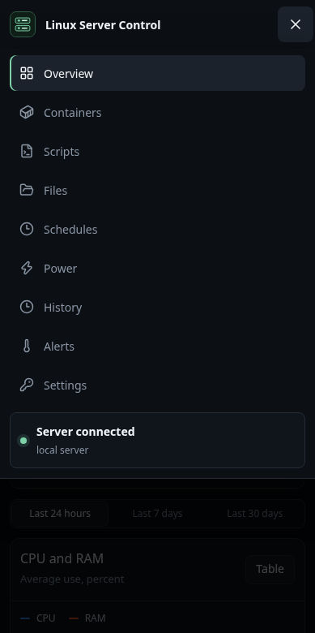

# User guide

A tour of Linux Server Control once it is installed. For installation, see [INSTALL.md](../INSTALL.md).

The screenshots use a demonstration server with made-up containers, scripts, plugs and addresses.

On every page, the **⋯** button at the end of a row opens what can be done with that row: edit, pause, delete and so on. Nothing is deleted by a single click: deleting always asks first.

## Contents

1. [Signing in](#signing-in)
2. [Overview](#overview)
3. [Containers](#containers)
4. [Scripts](#scripts)
5. [Files](#files)
6. [Schedules](#schedules)
7. [Power](#power)
8. [History](#history)
9. [Alerts](#alerts)
10. [Settings](#settings)
11. [On a phone](#on-a-phone)
12. [Troubleshooting](#troubleshooting)

## Signing in

The installer ends with the dashboard's address and a one-time setup token. The dashboard also prints the token to its logs until setup is done:

```bash
cd ~/linux-server-control
docker compose logs dashboard | grep "setup token"
```

Open `http://<server-ip>:8443`, enter the token, choose a username and a password of at least 12 characters, and confirm the server connection. That browser is authorized automatically.

If the server lacks a tool that a page needs, such as `python3` for Files or `cron` for Schedules, setup lists it before opening the dashboard. Nothing is blocked; install it when convenient.

Every other browser or phone needs a one-time **access code** the first time it signs in. Create one on an authorized browser under **Settings → Authorized browsers → Generate access code**, then, on the new browser, open **New browser? Enter an enrollment code** on the sign-in page.


After five wrong passwords a browser is blocked for 15 minutes. Browsers that are not enrolled yet share one limit, so guessing from new browsers never locks out your own.

If no authorized browser is left, or the password is forgotten, see [Locked out](../INSTALL.md#locked-out) in the installation guide.

## Overview

The landing page: containers, CPU, RAM and disk at a glance, anything that needs attention, and charts for the last 24 hours, 7 days or 30 days. Once you add smart plugs, their power and energy appear here too.

**Attention needed** lists what is wrong now, not everything that ever went wrong: stopped containers, alert rules whose value is above their threshold, and scripts and schedules whose latest run failed. A failed script or schedule leaves the list once it runs successfully again; the failure itself stays under **History**.


Every chart has a **Table** button that shows the same numbers as a table. Hover a chart, or focus it and use the arrow keys, to read the values at a point in time.

## Containers

All Docker containers on the server, running and stopped, with filters, current resource use and storage.

- The buttons next to a container open its web interface, for example `8096` for Jellyfin. Apps that share a VPN container's network, like Radarr or Sonarr behind Gluetun, link to their usual port when the VPN container publishes it.
- Open a row for its details, logs, and **Start**, **Stop** or **Restart**. The disk size is read when you open the details. **Logs** shows the last 300 lines of both the output and the error stream, and follows them while live updates are on.


To link a container to a specific address, such as a domain or a path, add a label to it in its compose file:

```yaml
labels:
  - lsc.url=https://media.example.com/jellyfin
```

## Scripts

Shell scripts you approve can be run from the dashboard and followed live.

- **Add script** registers an existing `.sh` file from the allowed folders; **New custom script** writes a new one.
- Group scripts in folders, and give a script **run options** to choose from when you run it: preset arguments, or none, a file to pick, or a value to type at run time (a month, a name), which takes the place of `{value}` in the option's arguments.
- **Run** starts the script and opens its live log. Scripts can run as the SSH user or, with the [optional root helpers](../INSTALL.md#optional-run-scripts-and-schedules-as-root), as root. A run log keeps the first 10 MB of output.
- While a script runs, its row shows **Running**, and its log says since when. **Stop run**, in the log or in the script's **⋯** menu, ends the script and every process it started, after asking. A stopped run is recorded as *stopped*, not as a failure; a script that ignores the request is ended after 10 seconds.
- How a script runs is set in its **Edit** form, under **Run conditions**, rather than in the script itself:
  - **Time limit**: a run that takes longer is stopped and counts as failed, so alerts and notifications report it.
  - **Variables**: `NAME=value` lines the script reads as environment variables, for example `KEEP_SNAPSHOTS=3`. Root scripts take arguments only.
  - **Only one run at a time**: **Run** is refused while a run started from the dashboard is still going.
  - **Ask before each run**: for scripts that change or delete things, such as a restore.
  - **Announce successful runs**: notification channels with *Run succeeded* hear of each successful run, with its last line of output, not only of failures.

  The time limit and the variables also hold for the script's scheduled runs.
- **Schedule**, **Edit** and **Delete** are in the script's **⋯** menu. Deleting a script or a folder removes it from the dashboard, with its schedules; the `.sh` files stay on the server.


## Files

Browse, search, sort, edit, copy, move, rename and delete files inside the allowed folders only. Text files up to 512 KB open in the built-in editor, which asks before closing with changes that were not saved. Folder sizes are calculated after the listing appears; sorting by size measures the folders first, so it takes longer in large folders.


## Schedules

Run scripts, or single commands, on a schedule with cron. The form builds the cron expression for you, and a schedule can run one of its script's run options (one that needs no file and no typed value). Each schedule can be edited, paused or deleted from its **⋯** menu, and its runs appear under **History → Cron runs**.

A schedule can run as root once both root helpers are installed. Root schedules run only registered scripts from the folders approved for root, never a custom command.


## Power

Record the power use of smart plugs and energy meters. Plugs are read every minute; the page shows the current power, today's and this month's energy, and the month's cost at your price per kWh.


To add a device, choose **Add device** and its type:

| Type | What to enter |
|---|---|
| TP-Link Tapo (P110, P115) | The plug's IP address and your Tapo account email and password. In the Tapo app, turn on **Me → Third-Party Services → Third-Party Compatibility** first. |
| Shelly | The IP address. Gen2+ devices need authentication off; Gen1 accepts a user and password. |
| Tasmota | The IP address, and the web password if one is set. |
| Home Assistant | The Home Assistant URL, a long-lived access token and the power sensor's entity ID. |

The device is read once before it is saved, so a wrong address or password is reported straight away. Tapo, Shelly and Tasmota plugs, and Home Assistant devices with a switch entity, can also be turned on and off from their **⋯** menu; turning one off asks first, because everything plugged into it loses power. Give plugs a fixed IP address in your router so they keep working.

A plug that is away for a while can be paused instead of deleted: edit it and clear **Record this device**. A paused device is saved without being read, keeps its history, and sends no notifications.

## History

Every script run from the dashboard, with its status (running, success, failed or stopped), duration, arguments and full log, and every run of a schedule. Search and filter by status. A run that is still going can be stopped from its log.


## Alerts

Rules that fire when a value reaches a threshold: CPU temperature, CPU, RAM or system disk use, the use of the monitored storage paths, failed script runs in the last 24 hours, or stopped containers. The storage rule watches all the monitored paths at once and fires for the fullest. The cooldown stops an alert from repeating too often, and a rule that announced its threshold also announces, once, when the value is back below it. Rules are checked every 5 minutes, also while no browser is open; triggered alerts go to your notification channels, and a rule that is above its threshold is listed on Overview.


## Settings

- **Appearance**: choose a theme (Dark, Light, Nord, Dracula, Solarized, Gruvbox, Catppuccin, Tokyo Night, Rosé Pine, Black, Latte, or System to follow the device). Each browser keeps its own choice.
- **Notifications**: send alerts (and their return to normal), failed runs, successful runs of the scripts set to announce them, and power device changes to Discord, Slack (also Mattermost and Rocket.Chat), ntfy, or any webhook that accepts JSON. Choose the events per channel and use **Test** to check it.
- **Server connection**: the SSH target and port, the allowed folders and how long metrics are kept. Saving tests the connection first and keeps the previous settings if the server does not answer. **Check server requirements** tests what the server provides and names anything missing.
- **Storage monitoring**: the mounted folders shown as storage cards.
- **Authorized browsers**: see and revoke devices, and create access codes for new ones. The browser you are using is marked. The last authorized browser cannot be revoked, because no other could sign in afterwards.
- **Accounts**: add accounts for other people. An **Administrator** can change everything. A **Read-only** account sees the pages, history and logs, but has no Files page and cannot run, edit or delete anything.
- **Change password**, and **Dashboard settings backup** to export or restore scripts, schedules, folders, alerts, storage paths, the server connection and authorized browsers. Accounts, notification channels and power devices are not part of it, so no password, webhook or plug credential leaves the server.


To create a Discord webhook: in Discord, open the channel's settings, then **Integrations → Webhooks → New Webhook → Copy Webhook URL**. Treat the URL like a password; the dashboard never shows it again after saving.

## On a phone

The dashboard adapts to small screens. The pages are in the menu behind the **☰** button of the top bar, which stays in view while you scroll; health tiles sit two to a row, and tables and charts fit the width.

 

Added to the home screen, the dashboard opens as an app of its own: with its icon, on the whole screen, without the browser's address bar.

- **iPhone and iPad:** open the dashboard in Safari, then **Share → Add to Home Screen**.
- **Android:** in Chrome, **⋮ → Add to Home screen**, then **Install**.
- **A computer:** Chrome and Edge show **Install** in the address bar.

Android and computers install it as an app only over [HTTPS](../INSTALL.md#optional-https); over plain HTTP they add a shortcut that opens the browser. An iPhone installs it over either. The app may keep its sign-in apart from the browser's: if it opens on the sign-in page, sign in again, with an access code if it asks for one.

## Troubleshooting

**"Containers cannot be read".** The server answered but Docker did not. The message says whether Docker is missing, stopped, or not allowed for the SSH user; the rest of the dashboard keeps working.

**"Server unavailable" after signing in.** The dashboard cannot reach the server over SSH. Check that the server is on, and the key and `known_hosts` file in the `ssh/` folder. If the server's address or SSH port changed, an administrator can correct it right there, under **Change the connection settings**; the new settings are saved only if the server answers.

**No authorized browser is left, or the password is forgotten.** Both are solved with one command on the server: see [Locked out](../INSTALL.md#locked-out).

**A plug "refused the connection".** Check its IP address in the plug's own app, give it a fixed address in the router, and, for Tapo, turn on Third-Party Compatibility in the Tapo app. If it still refuses, unplug it for ten seconds.

**A plug "did not answer" or "cannot be reached".** It is off, out of Wi-Fi range, or on another network (a guest or IoT network) than the server.

**A notification channel shows "Last delivery failed".** Use **Test** to see the exact error. A removed Discord webhook answers HTTP 404: create a new one and paste its URL when editing the channel.

**Updating.** Run the [installer](../INSTALL.md#install-with-one-command) again, or, on the server, in the dashboard's folder:

```bash
docker compose pull
docker compose up -d
```

Then refresh the page in your browsers.
