# User guide

A tour of Linux Server Control once it is installed. For installation, see [INSTALL.md](../INSTALL.md).

The screenshots use a demonstration server with made-up containers, scripts, plugs and addresses.

## Contents

1. [Signing in](#signing-in)
2. [Overview](#overview)
3. [Containers](#containers)
4. [Scripts](#scripts)
5. [Files](#files)
6. [Schedules](#schedules)
7. [Power](#power)
8. [History](#history)
9. [Alerts](#alerts)
10. [Settings](#settings)
11. [On a phone](#on-a-phone)
12. [Troubleshooting](#troubleshooting)

## Signing in

The first time the dashboard starts, it prints a one-time setup token to its logs:

```bash
docker compose logs dashboard | grep "setup token"
```

Open `http://<server-ip>:8443`, enter the token, choose a username and a password of at least 12 characters, and confirm the server connection. That browser is authorized automatically.

If the server lacks a tool that a page needs, such as `python3` for Files or `cron` for Schedules, setup lists it before opening the dashboard. Nothing is blocked; install it when convenient.

Every other browser or phone needs a one-time **access code** the first time it signs in. Create one on an authorized browser under **Settings → Authorized browsers → Generate access code**, then, on the new browser, open **New browser? Enter an enrollment code** on the sign-in page.

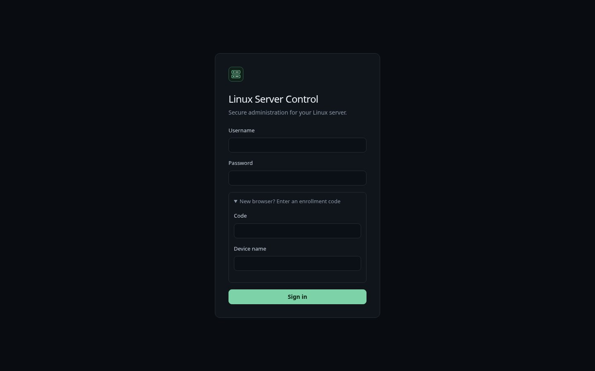

After five wrong passwords a browser is blocked for 15 minutes. Browsers that are not enrolled yet share one limit, so guessing from new browsers never locks out your own.

## Overview

The landing page: containers, CPU, RAM and disk at a glance, anything that needs attention (stopped containers, the latest failed run), and charts for the last 24 hours, 7 days or 30 days. Once you add smart plugs, their power and energy appear here too.


Every chart has a **Table** button that shows the same numbers as a table. Hover a chart, or focus it and use the arrow keys, to read the values at a point in time.

## Containers

All Docker containers on the server, running and stopped, with filters, current resource use and storage.

- The buttons next to a container open its web interface, for example `8096` for Jellyfin. Apps that share a VPN container's network, like Radarr or Sonarr behind Gluetun, link to their usual port when the VPN container publishes it.
- Open a row for its details, logs, and **Start**, **Stop** or **Restart**. The disk size is read when you open the details.

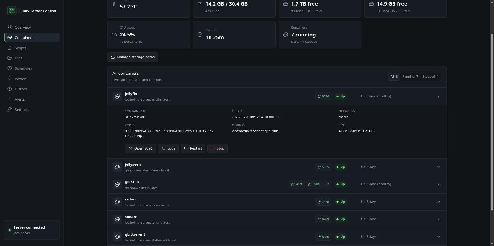

To link a container to a specific address, such as a domain or a path, add a label to it in its compose file:

```yaml
labels:
  - lsc.url=https://media.example.com/jellyfin
```

## Scripts

Shell scripts you approve can be run from the dashboard and followed live.

- **Add script** registers an existing `.sh` file from the allowed folders; **New custom script** writes a new one.
- Group scripts in folders, and give a script **run options** (preset arguments) to choose from when you run it.
- **Run** starts the script and opens its live log. Scripts can run as the SSH user or, with the [optional root helpers](../INSTALL.md#optional-run-scripts-and-schedules-as-root), as root. A run log keeps the first 10 MB of output.

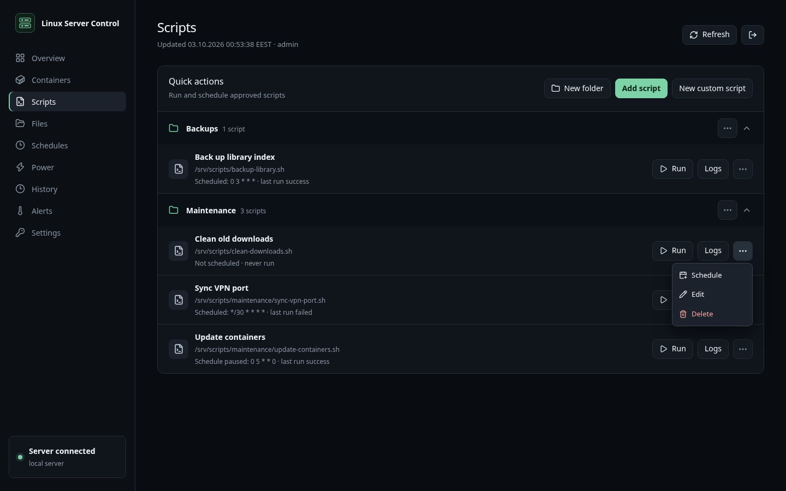

## Files

Browse, search, sort, edit, copy, move, rename and delete files inside the allowed folders only. Text files up to 512 KB open in the built-in editor. Folder sizes are calculated after the listing appears; sorting by size measures the folders first, so it takes longer in large folders.

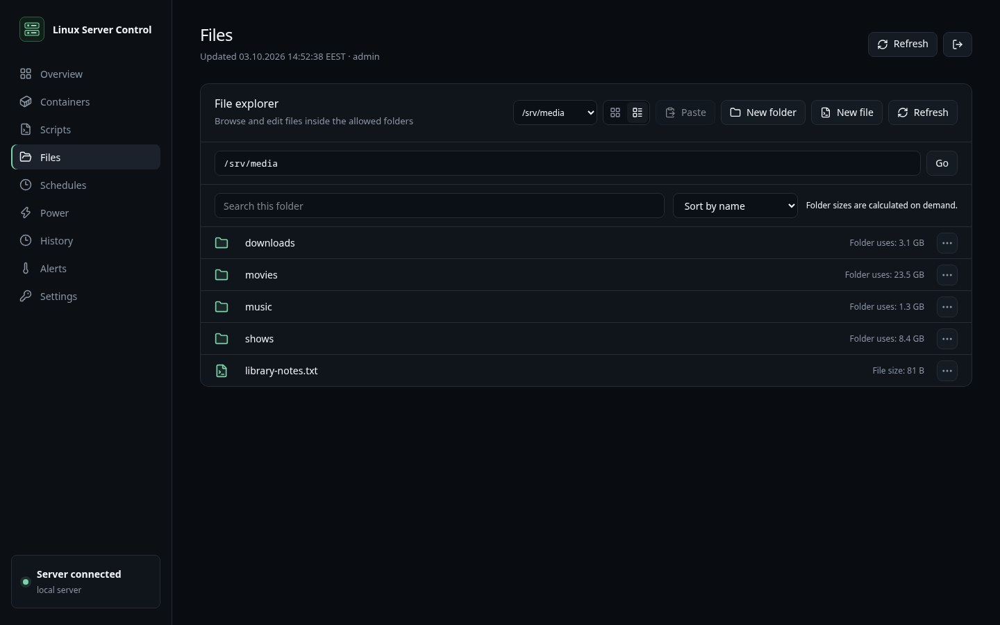

## Schedules

Run scripts, or single commands, on a schedule with cron. The form builds the cron expression for you. Each schedule can be paused, edited or deleted, and its runs appear under **History → Cron runs**.

A schedule can run as root once both root helpers are installed. Root schedules run only registered scripts from the folders approved for root, never a custom command.

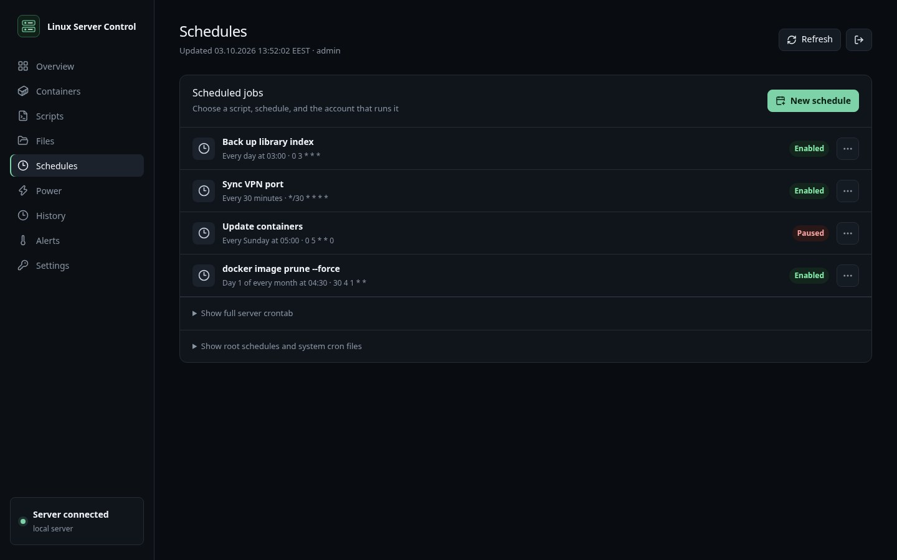

## Power

Record the power use of smart plugs and energy meters. Plugs are read every minute; the page shows the current power, today's and this month's energy, and the month's cost at your price per kWh.

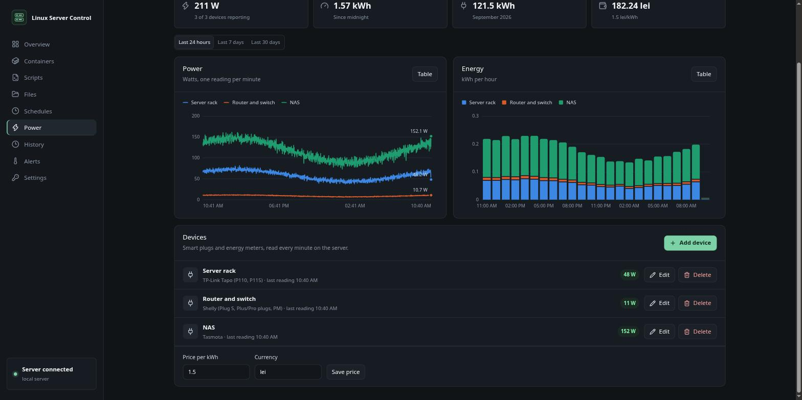

To add a device, choose **Add device** and its type:

| Type | What to enter |
|---|---|
| TP-Link Tapo (P110, P115) | The plug's IP address and your Tapo account email and password. In the Tapo app, turn on **Me → Third-Party Services → Third-Party Compatibility** first. |
| Shelly | The IP address. Gen2+ devices need authentication off; Gen1 accepts a user and password. |
| Tasmota | The IP address, and the web password if one is set. |
| Home Assistant | The Home Assistant URL, a long-lived access token and the power sensor's entity ID. |

The device is read once before it is saved, so a wrong address or password is reported straight away. Give plugs a fixed IP address in your router so they keep working.

## History

Every script run from the dashboard, with its status, duration, arguments and full log, and every run of a schedule. Search and filter by status.

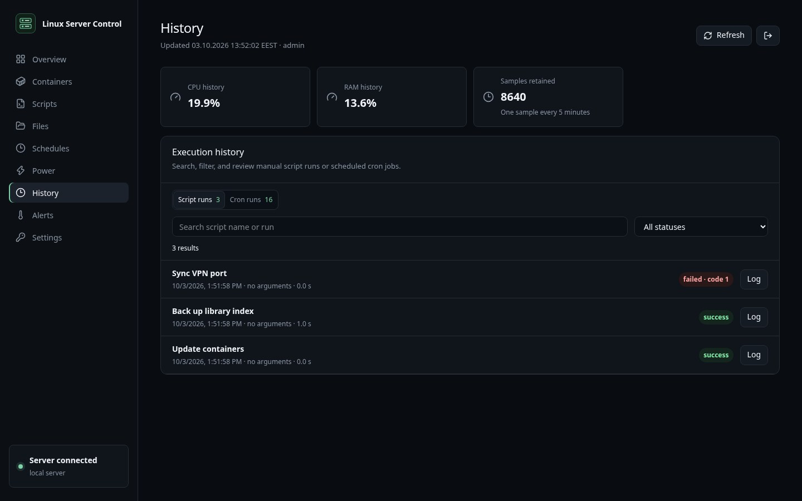

## Alerts

Rules that fire when a value reaches a threshold: CPU temperature, CPU, RAM or disk use, failed script runs in the last 24 hours, or stopped containers. The cooldown stops an alert from repeating too often. Rules are checked every 5 minutes, also while no browser is open, and triggered alerts go to your notification channels.

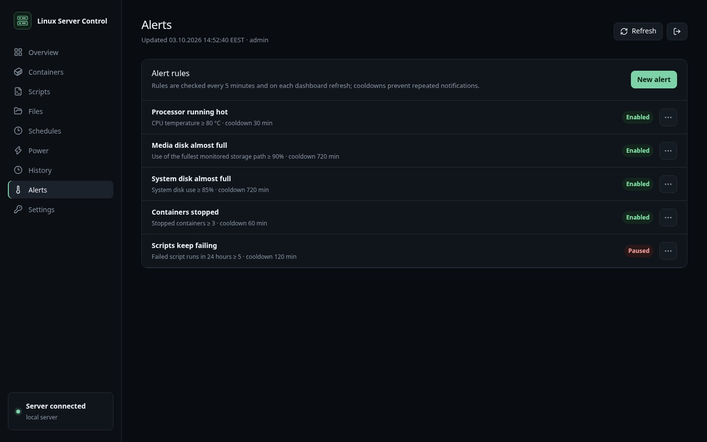

## Settings

- **Appearance**: choose a theme (Dark, Light, Nord, Dracula, Solarized, Gruvbox, Catppuccin, Tokyo Night, Rosé Pine, Black, Latte, or System to follow the device). Each browser keeps its own choice.
- **Notifications**: send alerts, failed runs and power device changes to Discord, Slack (also Mattermost and Rocket.Chat), ntfy, or any webhook that accepts JSON. Choose the events per channel and use **Test** to check it.
- **Server connection**: the SSH target and port, the allowed folders and how long metrics are kept. **Check server requirements** tests what the server provides and names anything missing.
- **Storage monitoring**: the mounted folders shown as storage cards.
- **Authorized browsers**: see and revoke devices, and create access codes for new ones.
- **Accounts**: add accounts for other people. An **Administrator** can change everything. A **Read-only** account sees the pages, history and logs, but has no Files page and cannot run, edit or delete anything.
- **Change password**, and **Dashboard settings backup** to export or restore scripts, schedules, folders, alerts and devices.

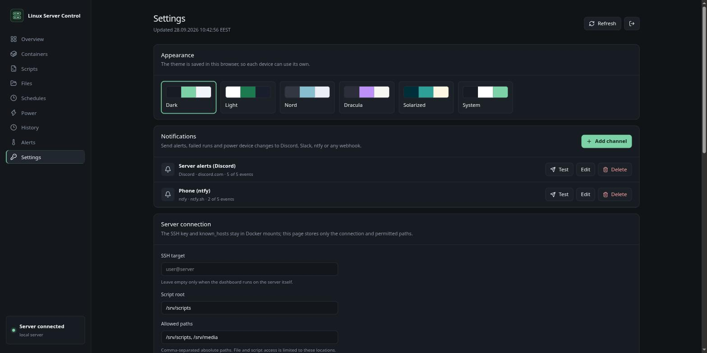

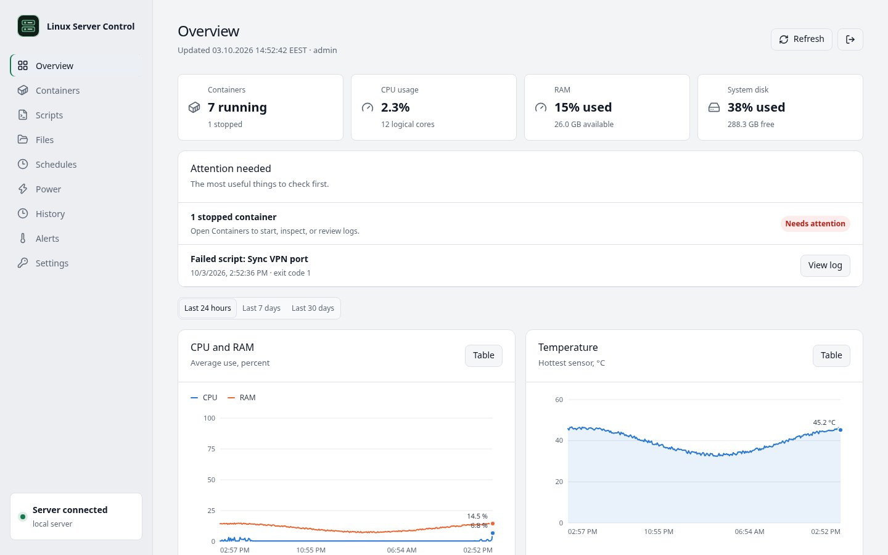

To create a Discord webhook: in Discord, open the channel's settings, then **Integrations → Webhooks → New Webhook → Copy Webhook URL**. Treat the URL like a password; the dashboard never shows it again after saving.

## On a phone

The dashboard adapts to small screens: the menu becomes a row you can scroll, and tables and charts fit the width. Add it to your home screen from the browser menu for quick access.

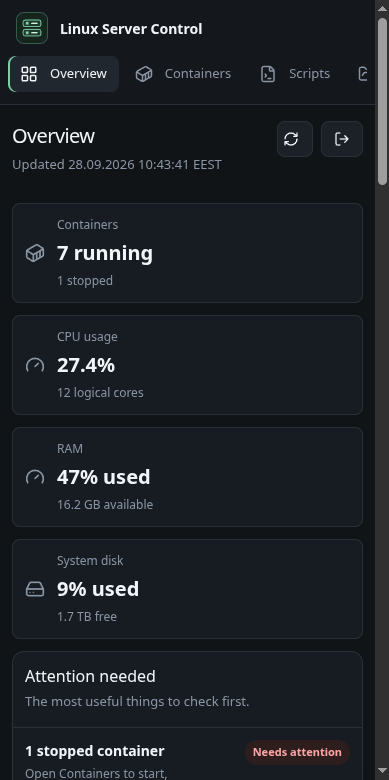

## Troubleshooting

**"Containers cannot be read".** The server answered but Docker did not. The message says whether Docker is missing, stopped, or not allowed for the SSH user; the rest of the dashboard keeps working.

**"Server unavailable" after signing in.** The dashboard cannot reach the server over SSH. Check that the server is on, and the SSH target, key and `known_hosts` file under **Settings → Server connection** and in the `ssh/` folder.

**A plug "refused the connection".** Check its IP address in the plug's own app, give it a fixed address in the router, and, for Tapo, turn on Third-Party Compatibility in the Tapo app. If it still refuses, unplug it for ten seconds.

**A plug "did not answer" or "cannot be reached".** It is off, out of Wi-Fi range, or on another network (a guest or IoT network) than the server.

**A notification channel shows "Last delivery failed".** Use **Test** to see the exact error. A removed Discord webhook answers HTTP 404: create a new one and paste its URL when editing the channel.

**Updating.** On the server, in the dashboard's folder:

```bash
docker compose pull
docker compose up -d
```

Then refresh the page in your browsers.
